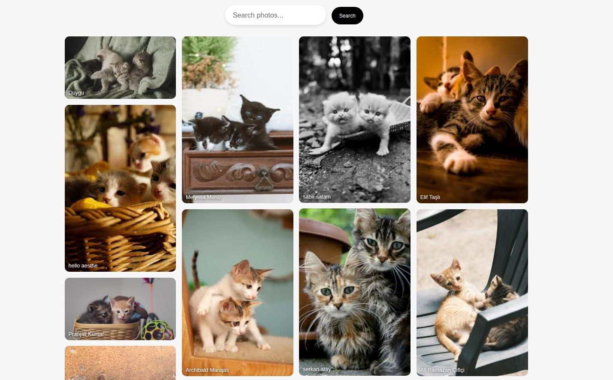

# Pexels API Client (Rails)

Part of The Odin Project, to build a client that talks to the Pexels API and use it in a Rails app.

At first the instructions felt pretty vague, and I didn’t really get what “creating a client” meant.
Once I understood the basic pattern - make a request, parse the response, clean the data - everything started to make sense.

After that, adding things like search and curated photos was just reusing the same structure with a different endpoint.
Plugging it into Rails was actually simple once the client was working on its own.

At the end I added some style so it feels more like a real app and not just API output.

## Screenshot

